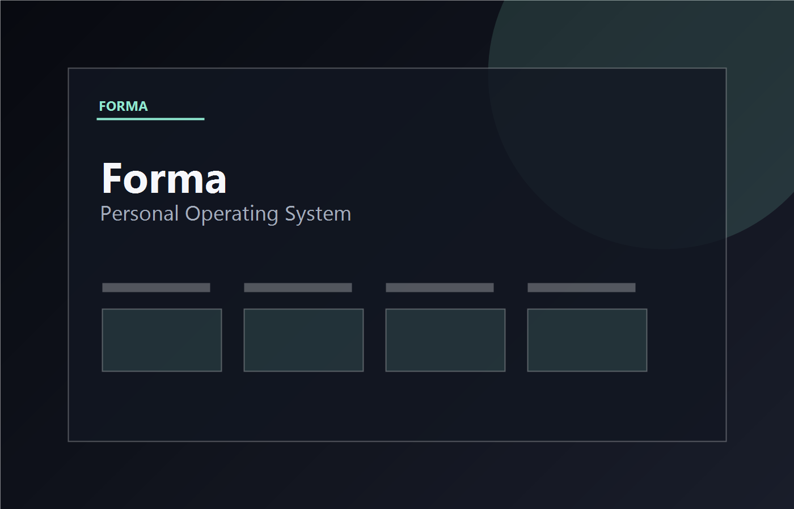
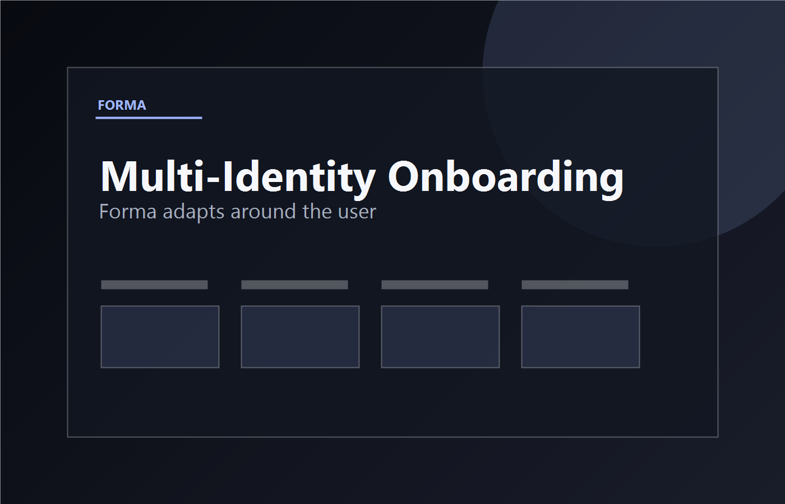
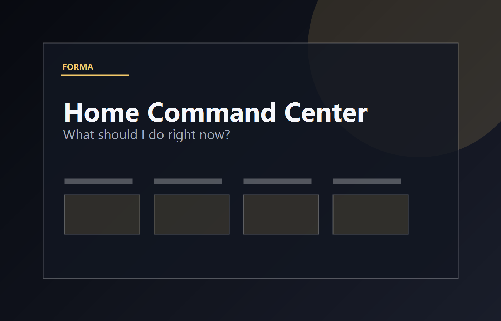
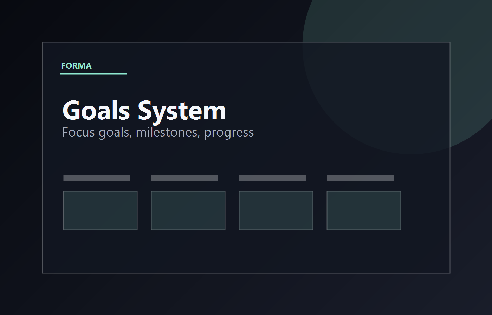
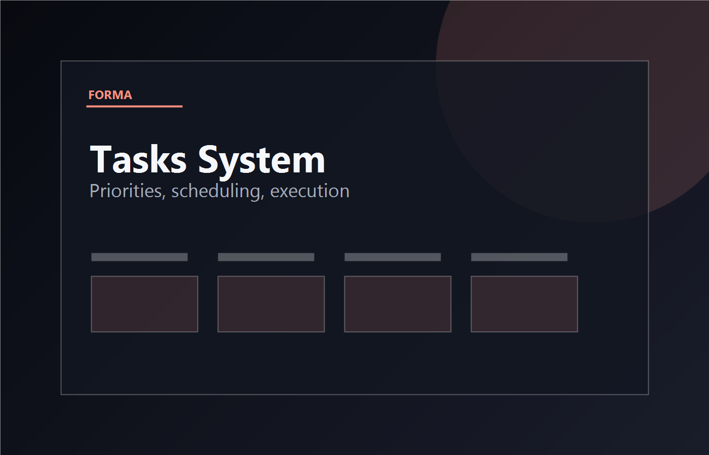
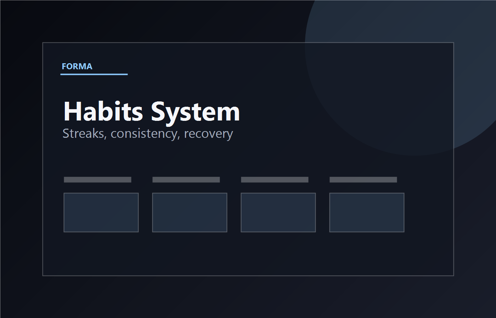
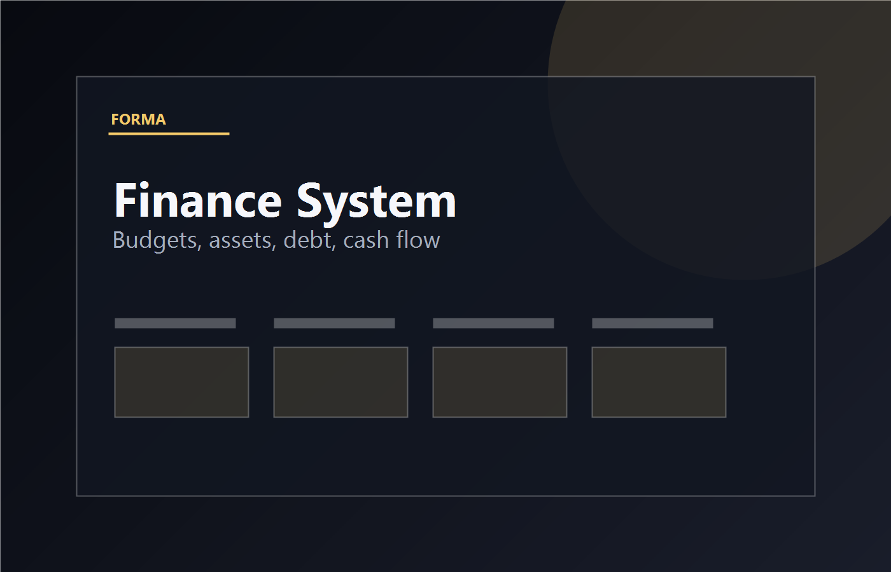
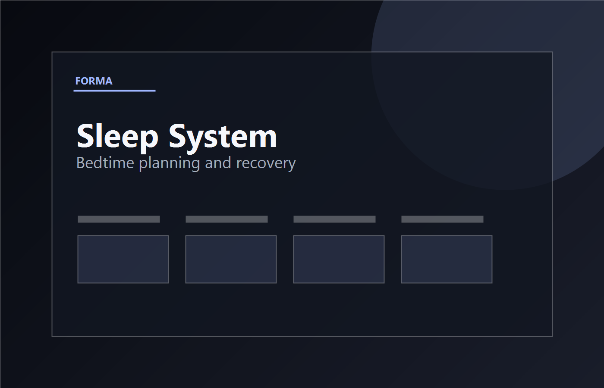
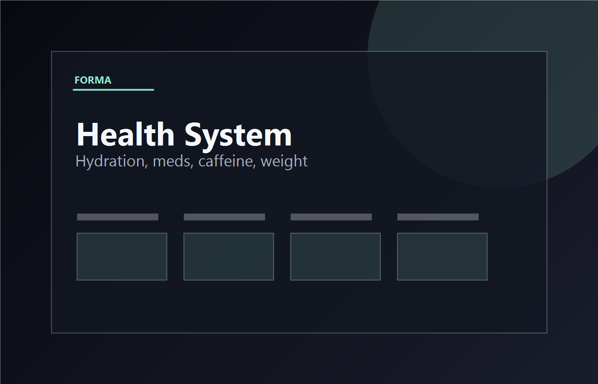
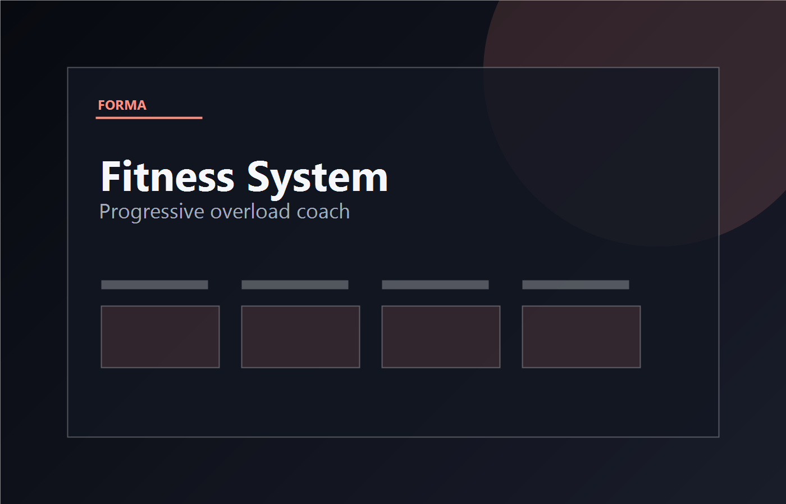

# Forma

<p align="center">
  
</p>

**Personal Operating System**

Forma is a local-first Personal Operating System that helps structure planning, execution, health, fitness, finance, sleep, habits, goals, notes, and adaptive life management in one connected workspace.

## Overview

Forma adapts to the user instead of forcing the user into a fixed productivity system. During onboarding, the user describes their identities, goals, constraints, and desired structure. Forma then generates a personalized operating system: modules, navigation, priorities, recommendations, and daily guidance.

The product is built around one central question:

**What should I do right now?**

Rather than acting like a dashboard of disconnected statistics, Forma uses module data to surface the next useful action.

## Philosophy

Forma is designed around connected life management:

- Home acts as a command center.
- Modules work together instead of living as isolated tools.
- Priorities are surfaced automatically from the user's current system.
- Life categories remain connected across execution, recovery, money, health, learning, and reflection.

The goal is not to create more places to store information. The goal is to reduce decision friction and help the user act.

## Core Features

### Multi-Identity Onboarding

Users can select multiple identities such as student, athlete, creator, professional, builder, and finance-focused. Forma combines those signals with goals, friction, time horizon, and structure preference to generate the workspace.

### Dynamic Module System

Forma automatically generates modules from onboarding, then allows users to enable, disable, and reprioritize modules later from Settings. Disabled modules are hidden without deleting data.

### Goals System

- Focus goals
- Milestones
- Progress tracking
- Goal health
- Next actions
- Templates
- Achievements

### Tasks System

- Priorities
- Scheduling
- Completion tracking
- Inbox
- Weekly view
- Recurring tasks
- Focus mode

### Habits System

- Streaks
- Consistency
- Daily tracking
- Habit types
- Habit stacks
- Recovery recommendations

### Notes System

- Rich notes
- Organization
- Search
- Tags and categories
- Templates
- Daily journal
- Knowledge vault
- Note connections

### Finance System

- Transactions
- Budgets
- Assets
- Debt tracking
- Recurring payments
- Monthly resets
- Rule-based insights

### Sleep System

- Bedtime planning
- Daily timeline
- Recovery guidance
- Sleep checklist
- Sleep history

### Health System

- Hydration
- Supplements
- Medications
- Weight tracking
- Caffeine tracking
- Health history

### Fitness System

- Progressive overload coach
- Exercise database
- Weight trends
- Progress photos
- Split management
- Gym profiles
- Session history

### Platform Features

- Developer Mode
- Module Management
- Interactive Tutorial
- Daily Reset Engine
- Cross-Module Intelligence

## Screenshots

### Front Face Start

The first screen introduces Forma as a premium personal operating system.



### Onboarding

Multi-identity onboarding helps Forma understand the user's context before generating modules.



### Home Module

Home acts as the command center, surfacing the most important action, timeline, alerts, tomorrow preview, and system health.



### Goals

Goals connect outcomes to milestones, next actions, focus goals, health, and achievements.



### Tasks

Tasks organize execution across priorities, due dates, recurring work, weekly planning, and focus mode.



### Habits

Habits track daily consistency, streaks, recovery recommendations, and habit stacks.



### Finance

Finance provides transactions, budgets, savings goals, investments, debts, recurring obligations, and rule-based insights.



### Sleep

Sleep plans the day around bedtime, caffeine cutoff, wind-down, screens-off, and recovery guidance.



### Health

Health tracks hydration, supplements, medications, caffeine, weight, and daily wellness history.



### Fitness

Fitness provides progressive overload coaching, exercises, split management, bodyweight trends, and progress photos.



## Architecture

Forma is a modular local-first web application.

- **Modular design:** Each life area is represented by an independent module.
- **Independent systems:** Tasks, habits, goals, notes, finance, sleep, health, and fitness keep their own state and workflows.
- **Shared user profile:** Onboarding creates a user profile that drives module generation and prioritization.
- **Home command center:** Home reads module data and turns it into concise recommendations.
- **Persistent data:** User state is stored locally in `localStorage`.

Forma currently runs entirely in the browser. There is no backend service, account system, API dependency, or cloud sync in this release.

## Technology

This project uses a lightweight static frontend stack:

- HTML
- CSS
- Vanilla JavaScript
- Browser `localStorage`

There is no framework, package manager, build step, or backend required for the current release.

## Installation

Clone the repository:

```bash
git clone <repository-url>
cd forma
```

Open the app directly:

```bash
start index.html
```

Or serve it with any static web server:

```bash
python -m http.server 8000
```

Then open:

```text
http://localhost:8000
```

## Roadmap

Future improvements:

- AI assistant
- Calendar integration
- Mobile applications
- Notifications
- Advanced analytics
- Additional modules
- Cloud synchronization

## Why Forma Exists

Traditional productivity apps often split life into disconnected systems: a task list for work, a habit tracker for routines, a notes app for thinking, a finance tracker for money, a fitness app for training, and a sleep tracker for recovery.

That separation creates friction. The user must constantly decide which app matters, what information is relevant, and how each part of life affects the others.

Forma exists to connect those categories into one operating system. It does not simply store data. It uses the user's modules to surface priorities, context, and next actions so the user can move through the day with less uncertainty.

## License

Forma uses the MIT License. See [LICENSE](LICENSE) for details.
